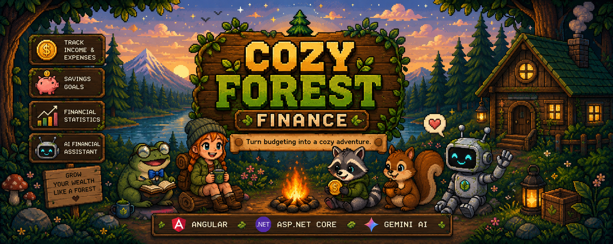
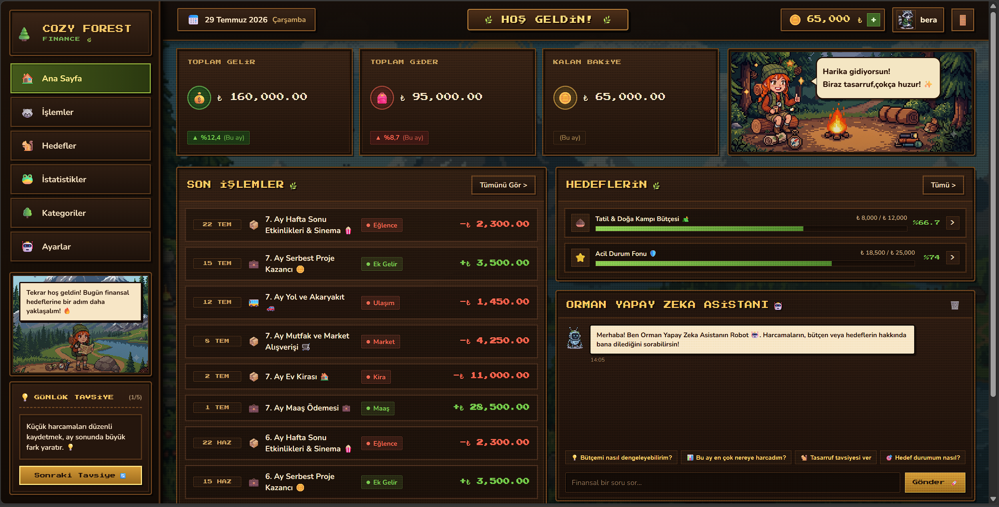
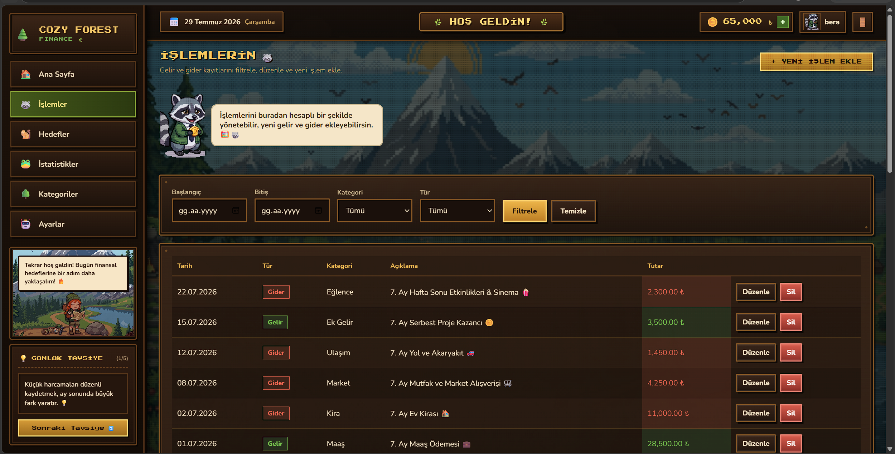
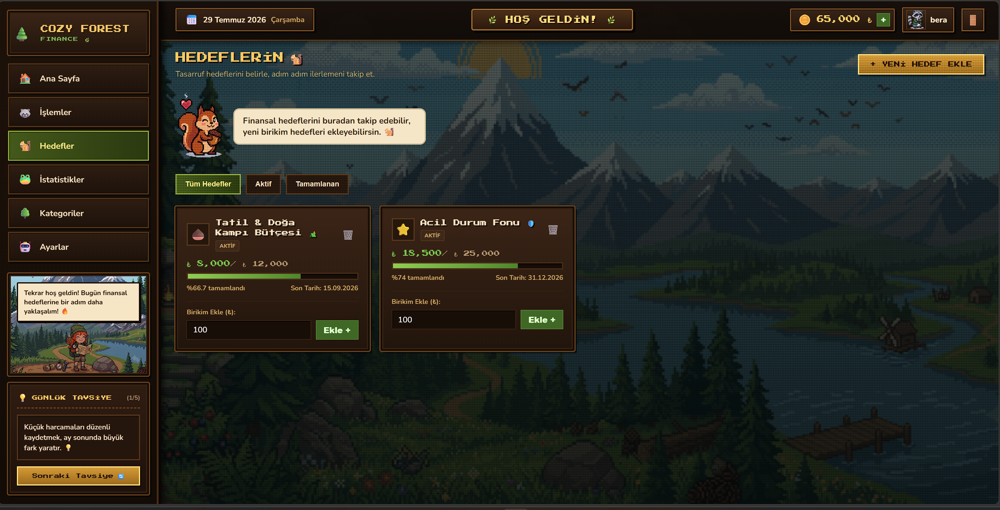
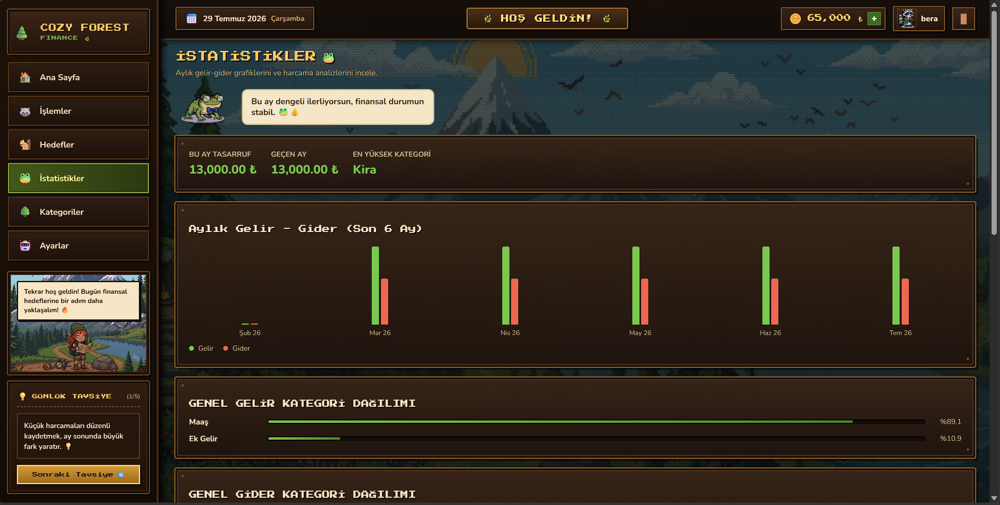
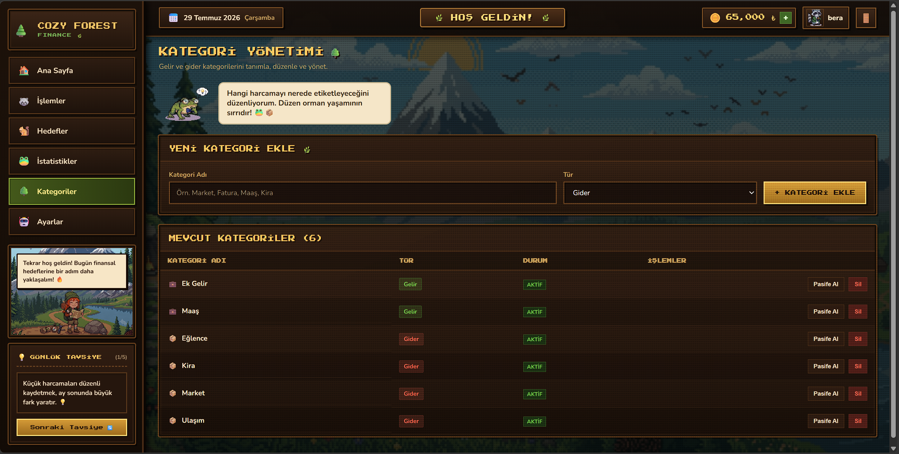
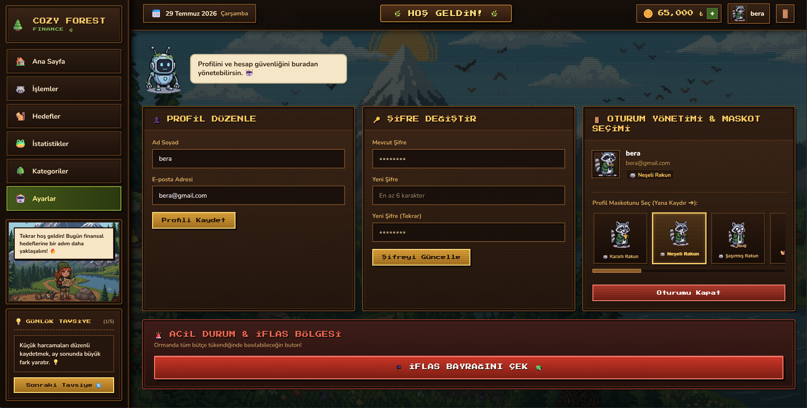
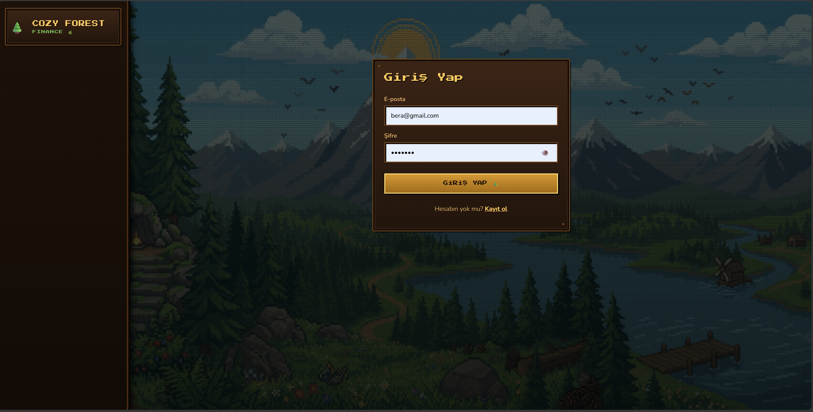

<p align="center">
  
</p>

<h1 align="center">🌲 CozyForestFinance</h1>

<p align="center">
  <b>Turn budgeting into a cozy adventure.</b>
</p>

<p align="center">
A pixel-art themed personal finance application built with <b>Angular</b> and <b>ASP.NET Core</b>, featuring expense tracking, savings goals, financial statistics, and an AI-powered assistant.
</p>

<p align="center">


</p>

---

# ✨ Overview

Managing personal finances shouldn't feel overwhelming.

**CozyForestFinance** transforms traditional budgeting into an enjoyable pixel-art experience where users can monitor their finances inside a cozy forest-themed world.

The application combines a modern full-stack architecture with game-inspired visuals to make financial management more engaging while still providing practical budgeting tools.

---

# 🚀 Features

- 🔐 JWT Authentication
- 💰 Income & Expense Tracking
- 📂 Category Management
- 🎯 Savings Goals
- 📊 Financial Statistics & Charts
- 🤖 AI Financial Assistant (Gemini API)
- 👤 Profile & Account Management
- 🦝 Pixel-Art Characters & Interactive UI
- 🌲 Cozy Forest Theme
- 📱 Responsive Design

---

# 📸 Screenshots

## 🏠 Dashboard



The dashboard provides a complete overview of:

- Current Balance
- Total Income
- Total Expenses
- Recent Transactions
- Savings Goals
- AI Financial Assistant

---

## 💰 Transaction Management



Users can:

- Add transactions
- Edit transactions
- Delete transactions
- Filter by category
- Filter by date
- Track spending history

---

## 🎯 Savings Goals



Track financial goals by:

- Creating custom goals
- Monitoring progress
- Adding savings
- Viewing completion percentages

---

## 📊 Financial Statistics



Visual reports include:

- Monthly Income vs Expense
- Category Analysis
- Savings Summary
- Spending Insights

---

## 🌳 Category Management



Manage:

- Income Categories
- Expense Categories
- Active / Passive Status

---

## ⚙️ User Settings



Includes:

- Profile Editing
- Password Update
- Avatar Selection
- Session Management

---

## 🔐 Authentication



Secure authentication powered by JWT.

---

# 🏗️ Architecture

```
CozyForestFinance
│
├── Backend
│   ├── API
│   ├── Application
│   ├── Domain
│   └── Infrastructure
│
└── Frontend
    ├── Angular
    ├── Components
    ├── Services
    ├── Guards
    └── Assets
```

---

# 🛠️ Tech Stack

## Frontend

- Angular
- TypeScript
- SCSS
- RxJS

## Backend

- ASP.NET Core Web API
- C#
- Entity Framework Core
- JWT Authentication

## Database

- SQL Server

## AI Integration

- Google Gemini API

---

# 🤖 AI Financial Assistant

The integrated AI assistant helps users better understand their financial habits.

Example topics:

- Budget Planning
- Spending Analysis
- Saving Recommendations
- Monthly Financial Insights
- Personalized Financial Advice

---

# 🚀 Getting Started

## Clone Repository

```bash
git clone https://github.com/nazifenisayildirim/CozyForestFinance.git
```

---

## Backend

```bash
cd Backend
dotnet restore
dotnet run
```

---

## Frontend

```bash
cd Frontend
npm install
ng serve
```

---

# 📁 Project Structure

```
Backend/
Frontend/
README.md
```

---

# 🌱 Future Improvements

- 📄 Export Reports (PDF / Excel)
- 🔔 Smart Notifications
- 🌍 Multi-language Support
- 📈 Advanced Analytics
- 🎖️ Achievement System
- 📱 Mobile Version

---

# 👩‍💻 Developer

**Nazife Nisa Yıldırım**

GitHub

https://github.com/nazifenisayildirim

---

<p align="center">

⭐ If you enjoyed this project, consider giving it a star!

</p>
